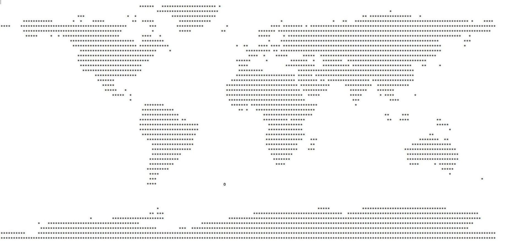

# International Space Station command line tracker :rocket:

Data modified: 02/02/2020  
Date created: 01/02/2020  

Authors: Yuryi Malakhau  

This program helps to track ISS in command line  
Used the following API: http://api.open-notify.org/  

## List of commands  
**loc**				gives the current geographical location of the ISS  
**graph**			shows the ISS as 0 symbol on the ASCII map in command line  
**pass**			prints the passing details of the ISS for your location  
**people**		prints people on the ISS  
**exit**				exits from the program  

